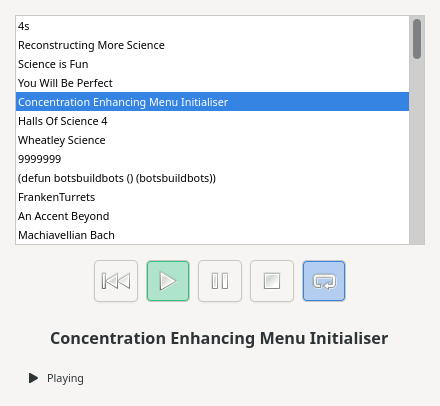

# Spotifice GUI

GTK4 graphical media control for Spotifice, compatible with its `spotifice_v1.ice`.



Features:

- Track list from `MediaProvider.get_all_tracks`: a click, or Enter, loads a track into the render.
- Play / Pause / Stop / Previous and a repeat toggle. The button matching the current state is highlighted.
- Periodic `get_status` polling, so the UI follows the render even when another client drives it.
- Every invocation is asynchronous, so a slow or dead render never blocks the window. While the render is
  unreachable the controls are disabled; when it comes back the provider is bound again and the track reloaded.


## Install

```bash
sudo apt install python3-zeroc-ice python3-gi gir1.2-gtk-4.0
make run   # or: python3 media_control_gui.py control.config
```

`control.config` holds the `Spotifice.MediaProvider.Proxy` and `Spotifice.MediaRender.Proxy` proxies.


## Tests

`make test` runs the tests, which need neither a display nor a running server: they cover the
asynchronous client (including the operation names generated from the slice), the error messages
and the state table.


## Authorship

This program was generated 100% with AI: Claude Code (Claude Opus 5), prompted and reviewed by
its author. Every change was checked
against a running `MediaProvider` and `MediaRender`.
